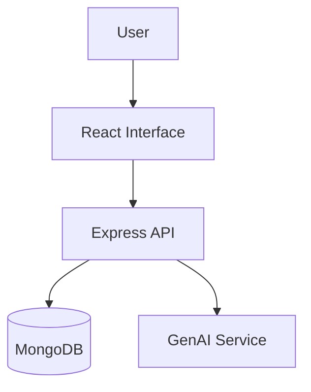

# 🚀 SkillMesh

> A skill-sharing and mentoring platform with database integration and interactive 3D UI.

### 🌐 Live Demo
[🚀 OPEN LIVE DEMO →](https://skillmesh-ten.vercel.app) | [💻 Source Code](https://github.com/YUVA-2329/SKILLMESH) 

---

## 🎬 Demo & 📸 Screenshots


*(Project preview and screenshots demonstrating the core user experience)*

---

## 🧠 About the Project

This project was built to solve real-world challenges through modern web technologies and advanced engineering. By combining scalable architecture with an intuitive user interface, SkillMesh provides an exceptional user experience while maintaining high performance and security.

### ✨ Key Features
- 🗄️ Persistent database storage with MongoDB
- 🧊 Interactive 3D graphics (Three.js)
- 🤖 GenAI features
- 🔐 Secure API architecture
- 🎉 Canvas confetti celebration effects

---

## 🛠️ Tech Stack

**Frontend:** React, TypeScript, Tailwind, Three.js
**Backend:** Node.js, Express, MongoDB
**AI:** Google GenAI

---

## 🏗️ Architecture



---

## ⚙️ How It Works

1. Users create profiles and list skills they want to learn or teach.
2. The Node.js backend handles matching logic and stores data in MongoDB.
3. AI suggests potential mentors based on profile similarity.

---

## 🚀 Getting Started

### Installation

```bash
git clone https://github.com/YUVA-2329/SKILLMESH.git
cd skillmesh
npm install
npm run dev
```

### Environment Variables
Create a `.env` file in the root directory:
```env
MONGO_URI=YOUR_MONGODB_URI
PORT=3000
GEMINI_API_KEY=YOUR_API_KEY
```

---

## 📁 Project Structure

```text
project/
├── src/
│   ├── components/
│   └── App.tsx
├── server.ts
├── models/
└── package.json
```

---

## 🛣️ Roadmap

- [x] Database setup
- [x] 3D landing page
- [x] AI mentor matching
- [ ] Real-time messaging

---

## 📊 Status

🟢 Active Development

---

## 👨‍💻 Author

**Yuva Kishore Peta**  
GitHub: [YUVA-2329](https://github.com/YUVA-2329)
